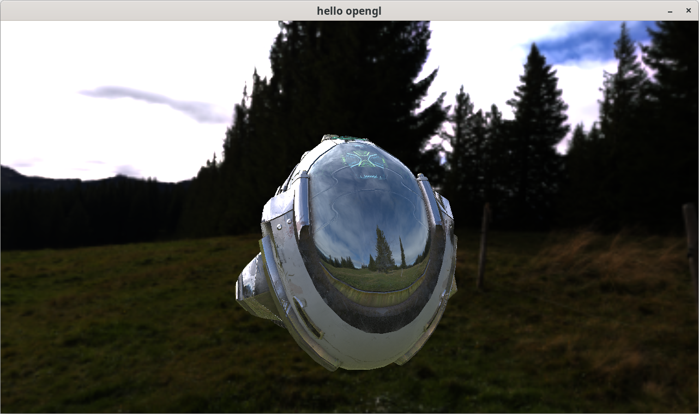

# Gluck 

A simple OpenGL PBR renderer (work in progress).

## Screenshot

## Features:

- [x] forward rendering
- [x] point light
- [x] image based lighting
- [x] environment mapping

## Todos:

- [ ] directional/spot light
- [ ] deferred rendering
- [ ] animation system

## Reference:

- [3D Graphics Rendering Cookbook](https://github.com/PacktPublishing/3D-Graphics-Rendering-Cookbook) by Sergey Kosarevsky & Viktor Latypov